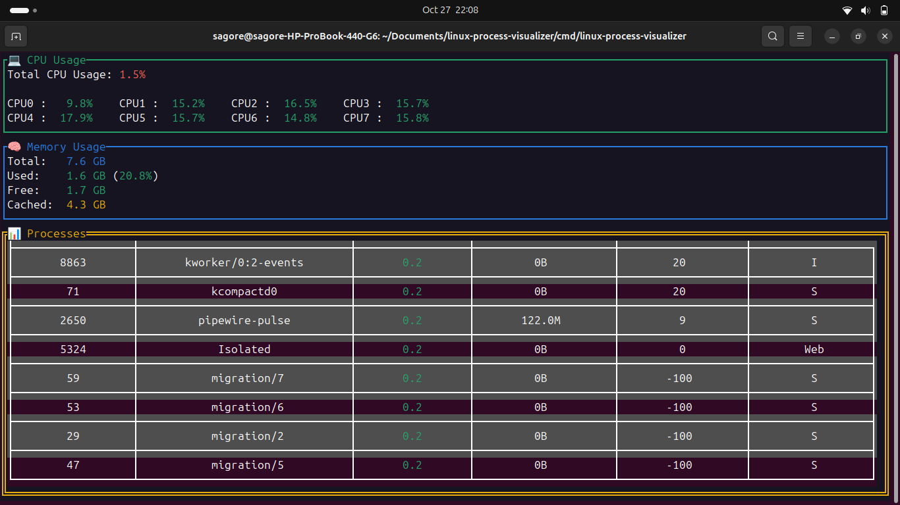

# Linux Process Visualizer

A lightweight, efficient system monitoring tool written in Go, inspired by linux process visualizer toll [htop](https://github.com/htop-dev/htop). This tool provides real-time system metrics including CPU usage, memory usage, and process information through an intuitive terminal user interface.


*the term ui for this project*

## Features

### System Monitoring
- Real-time CPU usage monitoring
  - Total CPU utilization
  - Per-core CPU usage statistics
  - CPU frequency and temperature
  - User, system, and idle percentages

### Memory Analysis
- Comprehensive memory statistics
  - Total memory available
  - Used memory
  - Free memory
  - Cached memory
  - Swap usage

### Process Management
- Detailed process information
  - Process ID (PID)
  - Process name and command
  - CPU usage percentage
  - Memory consumption
  - Process state
  - Process priority
- Real-time process sorting by CPU usage
- Auto-refresh every second


## Requirements

- Linux operating system
- Go 1.22 or higher

## Run the project

### From Source
```bash
# Clone the repository
git clone https://github.com/sagoresarker/linux-process-visualizer.git

# Change to project directory
cd linux-process-visualizer

# Build the project
go build ./cmd/linux-process-visualizer
```

## Usage

### Basic Usage
```bash
./linux-process-visualizer
```

### Keyboard Controls
- `q` or `Ctrl+C`: Exit the application
- `Up/Down`: Navigate through process list
- `ESC`: Exit process details view

## Acknowledgments

- Inspired by [htop](https://github.com/htop-dev/htop) and other system monitoring tools
- Built with [tview](https://github.com/rivo/tview) for the terminal interface